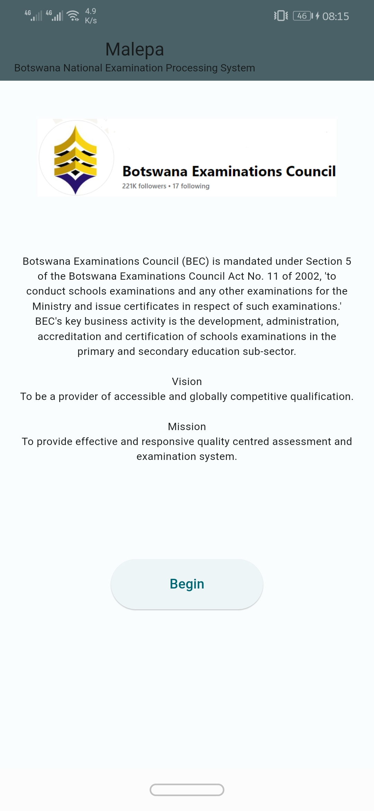

# BEC SERVICE [MALEPA] REDESIGN

A project funded by God

## Getting Started

This project is a starting point of rebuilding an educational grading system running 1990 < 2020 technology

## Original website
[Govt built](https://malepa.bec.co.bw/MALEPAGeneral/)

## Features of original website
- Registration, 
- Exam management
- Reports
- & Allocation

## Pain points
 - Small text
 - Manual input
 - Less user friendly
 - Goes down periodically

## WHAT'S NEW WITH THIS ONE?
 - Downtimes almost none existant
 - Web dependability reduced by 60%
 - Runs on any device
 - Fluent UI and clearer text

## Platform support
 - Website link: [All platforms](https://g-titan.github.io/malepa_redesign/)
 - Android support: https://github.com/G-Titan/malepa_redesign/releases
 - Windows support: (demo release date 6/May/2024)
 - IOS support: (This build may run on any device but we decided to completely not support this platform. it's an organisational choice. if you want it, build it yourself or give me money)
 - Linux support: (Demo release date 6/May/2024)

If you dont know what your device is using visit my [website](https://citynest.github.io/Life/) for more information on how to check your operating system information.... 

Yeh that's a prank.

- [Lab: A playground for you to get started](https://docs.flutter.dev/get-started/codelab)
- [Cookbook](https://docs.flutter.dev/cookbook)

For help getting started on how to contribute, pull requests and merges best to contact me [personally](mailto:kevinmanda92@gmail.com)

## PREVIEW
  

  

## Upcoming updates
 - Account manager (free)
 - Setting up registration